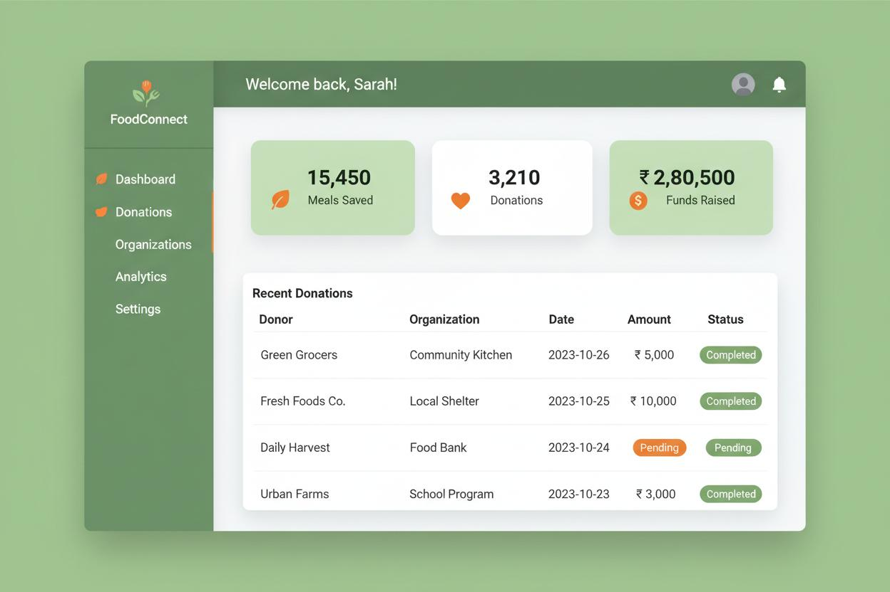
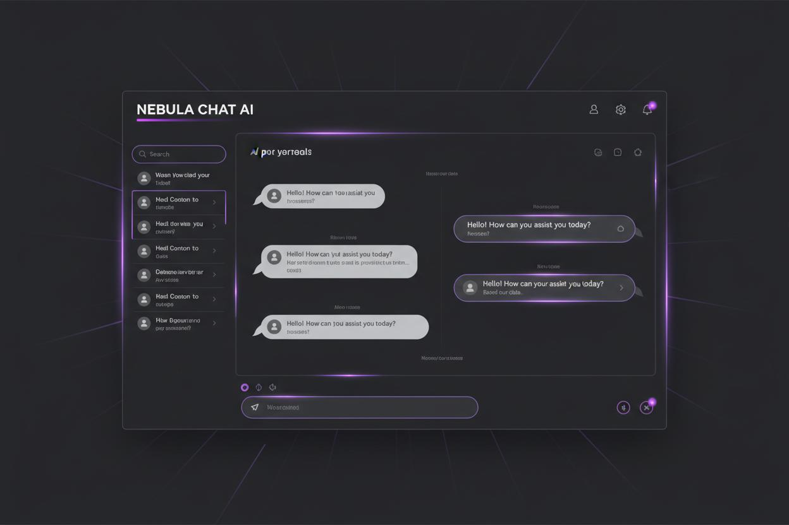
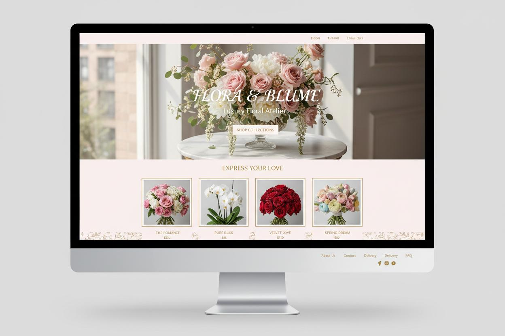
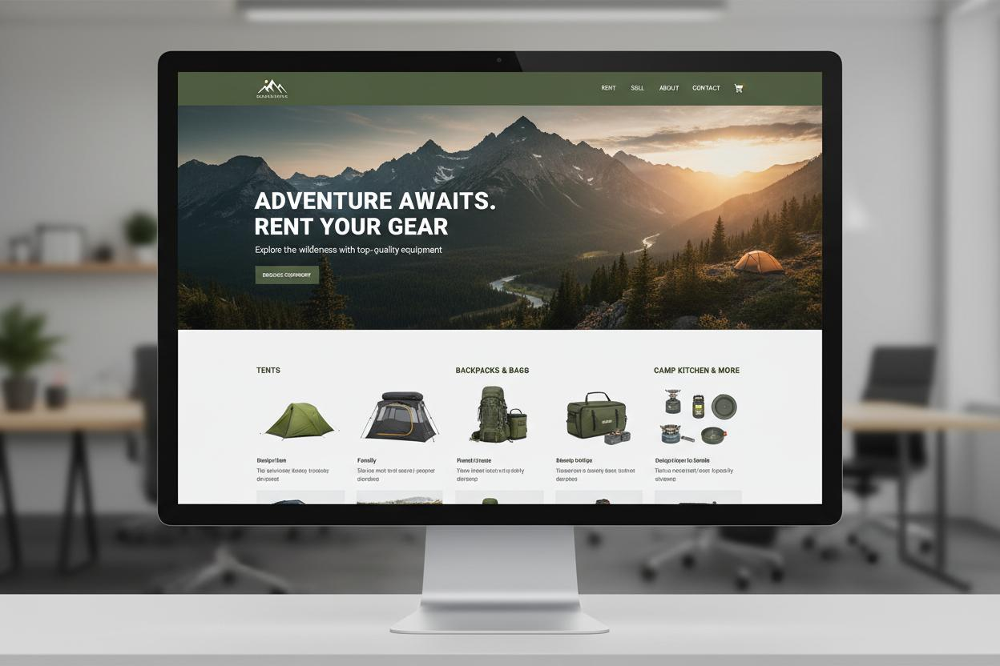

# Rahul Kumar Panda - Developer Portfolio

Recruiter-friendly portfolio website highlighting my full-stack engineering work, problem-solving approach, and production-style frontend execution.

<p align="center">
	
</p>

## Live Website

- Portfolio: https://rahul-panda564.github.io/MyPortfolio/
- GitHub Repository: https://github.com/Rahul-panda564/MyPortfolio

## Why This Portfolio Stands Out

- Clear personal brand with strong visual identity and smooth interaction design.
- Project-first storytelling with live demos, GitHub links, and concise impact-focused summaries.
- Modern engineering stack with React, TypeScript, animation orchestration, and component-driven architecture.
- Recruiter-ready contact surface with social links, availability signal, and direct email access.

## Highlights

## Visual Preview
### Featured Project Screens

| FoodSave | NexusAI |
| --- | --- |
|  |  |

| VelvetRose | Trekify |
| --- | --- |
|  |  |

## Live Project Links

- FoodSave
	- Live: https://rahul-panda564.github.io/FoodSave/
	- GitHub: https://github.com/Rahul-panda564/FoodSave
- NexusAI (AI SaaS Chat Interface)
	- Live: https://rahul-panda564.github.io/AI_SAAS_CHAT_INTERFACE/
	- GitHub: https://github.com/Rahul-panda564/AI_SAAS_CHAT_INTERFACE
- VelvetRose
	- Live: https://rahul-panda564.github.io/VelvetRose
	- GitHub: https://github.com/Rahul-panda564/VelvetRose
- Trekify
	- Live: https://rahul-panda564.github.io/Trekify
	- GitHub: https://github.com/Rahul-panda564/Trekify

- Cinematic hero section with typewriter title, staged animation timeline, and responsive CTA flow.
- Scroll-triggered reveals across major sections using GSAP and ScrollTrigger.
- Featured projects grid with tech tags, live previews, and source links.
- Structured skills map across frontend, backend, database, and tooling.
- Polished contact experience with animated UI states and confirmation feedback.

## Featured Work

| Project | Live | Source |
| --- | --- | --- |
| FoodSave | https://rahul-panda564.github.io/FoodSave/ | https://github.com/Rahul-panda564/FoodSave |
| NexusAI | https://rahul-panda564.github.io/AI_SAAS_CHAT_INTERFACE/ | https://github.com/Rahul-panda564/AI_SAAS_CHAT_INTERFACE |
| VelvetRose | https://rahul-panda564.github.io/VelvetRose | https://github.com/Rahul-panda564/VelvetRose |
| Trekify | https://rahul-panda564.github.io/Trekify | https://github.com/Rahul-panda564/Trekify |

## Tech Stack

- Frontend: React 19, TypeScript, Vite, Tailwind CSS
- Motion: GSAP, ScrollTrigger, SplitType
- UI System: Radix UI primitives, reusable UI components
- Tooling: ESLint, TypeScript project references, PostCSS

## Portfolio Sections

- Home: Intro, value proposition, social entry points
- Projects: Featured builds with demo and code links
- Skills: Category-wise proficiency and tech orbit visualization
- Contact: Email, location, social channels, message form UI

## Local Setup

Run from the app directory:

```bash
npm install
npm run dev
```

Production build:

```bash
npm run build
npm run preview
```

## Deploying To GitHub Pages

This repository is configured to deploy from main using GitHub Actions.

1. Push changes to main.
2. In GitHub, open Settings -> Pages.
3. Ensure Source is set to GitHub Actions.
4. Wait for the workflow named Deploy Portfolio to GitHub Pages to complete.

Your site will publish at:

- https://rahul-panda564.github.io/MyPortfolio/

## Contact

- Email: rahulpanda432@gmail.com
- LinkedIn: https://www.linkedin.com/in/rahul-kumar-panda-770118178
- GitHub: https://github.com/Rahul-panda564
- Location: Berhampur, Odisha, India

## License

Licensed under MIT. See [LICENSE](LICENSE).
